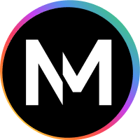

<div id="top"></div>

<!-- PROJECT SHIELDS -->

<!--
*** I'm using markdown "reference style" links for readability.
*** Reference links are enclosed in brackets [ ] instead of parentheses ( ).
*** See the bottom of this document for the declaration of the reference variables
*** for contributors-url, forks-url, etc. This is an optional, concise syntax you may use.
*** https://www.markdownguide.org/basic-syntax/#reference-style-links
-->

[![Contributors][contributors-shield]][contributors-url]
[![Forks][forks-shield]][forks-url]
[![Stargazers][stars-shield]][stars-url]
[![Issues][issues-shield]][issues-url]
[![License][license-shield]][license-url]
[![LinkedIn][linkedin-shield]][linkedin-url]

<!-- PROJECT LOGO -->

<br />
<div align="center">
  <a href="https://projectnewm.io/">
    
  </a>

<h3 align="center">Project NEWM</h3>

  <p align="center">
    Using Non-Fungible Token (NFT) technology and Decentralized Finance (DeFi), projectNEWM is a music streaming platform and marketplace that cuts out the middlemen and enables Artists to distribute and monetize their works while maintaining ownership rights and interacting directly with fans and investors.
    <br />
    <a href="https://projectnewm.io/"><strong>Visit our website</strong></a>
    <br />
    <br />
    ·
    <a href="https://github.com/projectNEWM/newm-mobile/issues">Report Bug</a>
    ·
    <a href="https://github.com/projectNEWM/newm-mobile/issues">Request Feature</a>
    ·
  </p>
</div>


<!-- 📔 ABOUT THE PROJECT -->

## 📔 About The Project

<p> The iOS and Android apps for projectNEWM. Check out our <a href="https://projectnewm.io/"><strong>website</strong></a> for more info.<p>

### Built With

* [Kotlin Multiplatform](https://kotlinlang.org/docs/multiplatform.html)
* Native Android/iOS View and ViewModel layer

<!-- GETTING STARTED -->

## 📖 Getting Started

<p> Clone the repo, open in Android Studio or XCode and get to building! You will need to setup your own firebase instance and apply your google-services.json file to get things working. <p> You will also need to install <a href="https://github.com/SwiftGen/SwiftGen"><strong>SwiftGen</strong></a>.<p> Reach out to the team with any questions.<p>
<p> NOTE: You may have trouble building the project if you're on a VPN.<p>

<!-- ROADMAP -->

## 🚀 MVP Roadmap

<p> Coming soon! <p>

<p align="right">(<a href="#top">back to top</a>)</p>

<!-- CONTRIBUTING -->

## 🤝 Contributing

Contributions are what make the open source community such an amazing place to learn, inspire, and create. Any contributions you make are **greatly appreciated**.

If you have a suggestion, please fork the repo and create a pull request. You can also simply open an issue and we will get back to you ASAP.

1. Fork the Project
2. Create your Feature Branch (`git checkout -b feature/AmazingFeature`)
3. Commit your Changes (`git commit -m 'Add some AmazingFeature'`)
4. Push to the Branch (`git push origin feature/AmazingFeature`)
5. Open a Pull Request

Want to help out but don't have a specific idea or suggestion? Reach out to
<a href="https://github.com/martyu"> Marty</a> (mulrich@newm.io) and we can give you a ticket (or two 😉). We are also open to
bringing consistent contributors onto the core team.

Don't forget to give the project a star! ⭐️

<p align="right">(<a href="#top">back to top</a>)</p>

<!-- TEAM -->

## 😎 ProjectNEWM Mobile Development Team

<table>
  <tr>
    <td align="center"><a href="https://github.com/andymiller813"><br /><sub><b>Andy Miller</b></sub></a><br /> </td>
    <td align="center"><a href="https://github.com/martyu"><br /><sub><b>Marty Ulrich</b></sub></a><br /> </td>
    <td align="center"><a href="https://github.com/cristhianescobar"><br /><sub><b>Cristhian Escobar</b></sub></a><br /> </td>
    <td align="center"><a href="https://github.com/j-mateo"><br /><sub><b>Jose Mateo</b></sub></a><br /> </td>
  </tr>
</table>

<!-- SOCIALS -->

## ❤️ Join The Fam

- [Telegram](https://t.me/NEWMofficial)
- [Discord](https://discord.gg/z4sYqxqgvQ)
- [Twitter](https://twitter.com/projectNEWM)
- [Facebook](https://www.facebook.com/projectNEWM)
- [Instagram](https://www.instagram.com/projectnewm.io/)
- [Youtube](https://www.youtube.com/channel/UCcsBNWGjIf8YarD9uaZEEvw)
- [Contact Form](https://us1.list-manage.com/contact-form?u=3bf911620d8791d21fb973749&form_id=48757f902c8daa9f950e8d2563e8133e)

<p align="right">(<a href="#top">back to top</a>)</p>

<!-- LICENSE -->

## ⚖️ License

```
Copyright 2022 ProjectNEWM

Licensed under the Apache License, Version 2.0 (the "License");
you may not use this file except in compliance with the License.
You may obtain a copy of the License at

  http://www.apache.org/licenses/LICENSE-2.0

Unless required by applicable law or agreed to in writing, software
distributed under the License is distributed on an "AS IS" BASIS,
WITHOUT WARRANTIES OR CONDITIONS OF ANY KIND, either express or implied.
See the License for the specific language governing permissions and
limitations under the License.
```

<p align="right">(<a href="#top">back to top</a>)</p>


<!-- MARKDOWN LINKS & IMAGES -->

[contributors-shield]: https://img.shields.io/github/contributors/projectNEWM/newm-mobile.svg?style=for-the-badge
[contributors-url]: https://github.com/projectNEWM/newm-mobile/graphs/contributors
[forks-shield]: https://img.shields.io/github/forks/projectNEWM/newm-mobile.svg?style=for-the-badge
[forks-url]: https://github.com/projectNEWM/newm-mobile/network/members
[stars-shield]: https://img.shields.io/github/stars/projectNEWM/newm-mobile.svg?style=for-the-badge
[stars-url]: https://github.com/projectNEWM/newm-mobile/stargazers
[issues-shield]: https://img.shields.io/github/issues/projectNEWM/newm-mobile.svg?style=for-the-badge
[issues-url]: https://github.com/projectNEWM/newm-mobile/issues
[license-shield]: https://img.shields.io/github/license/projectNEWM/newm-mobile.svg?style=for-the-badge
[license-url]: https://github.com/projectNEWM/newm-mobile/LICENSE.txt
[linkedin-shield]: https://img.shields.io/badge/-LinkedIn-black.svg?style=for-the-badge&logo=linkedin&colorB=555
[linkedin-url]: https://www.linkedin.com/company/projectnewm/
